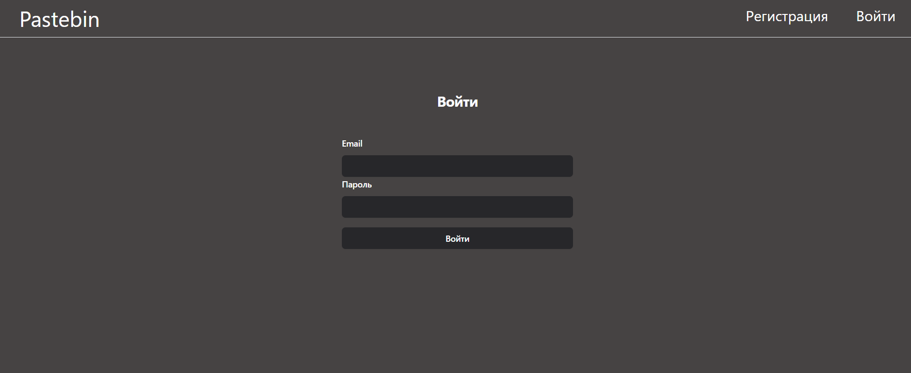

<h1 style="text-align: center">Pastebin</h1>
<h2>Описание</h2>

Это учебный проект, в котором создается аналог сервиса pastebin, который служит для обмена текстом между
пользователями. Пользователь пишет текст, выбирает время существования текста и сохраняет его. Далее появляется ссылка,
которой пользователь может поделиться с другими людьми, и они смогут прочитать данный текст. Также если пользователь
зарегестрируется, то он сможет удалять свои записи раньше отведенного времени.

Проект создавался для получения навыков бэкенд разработки, но также в данном сервисе есть визуализация 
созданных функций:

<h3>Главная страница:</h3>

<h3>Страница созданной записи:</h3>

<h3>Страница регистрации:</h3>

<h3>Страница авторизации:</h3>

<h3>Страница профиля:</h3>

<h2>Технологии</h2>
<ul>
<li>FastAPI</li>
<li>PostgreSQL</li>
<li>Redis</li>
<li>Celery</li>
<li>Yandex Cloud</li>
<li>Jinja2</li>
</ul>
<h2>О проекте</h2>

Приложение состоит из двух микросервисов: основной сервис, который принимает запросы от пользователей и сервис,
который генерирует id для новых записей. Такое разделение было сделано, чтобы уникальные идентификаторы генерировались
заранее, и можно было быстрее создавать записи, а также для получения опыта работы с микросервисами.

Метаданные записи хранятся в базе данных, а сам текст хранится в облачном хранилище (yandex cloud object storage).
Миграции в базе данных выполняются с помощью alembic. Также для удаления записей, у которых истек срок действия,
используется celery с заданием переодической задачи (раз в сутки ненужные записи удаляются из бд и облачного хранилища).
При этом для поддерживания запаса идентификаторов для новых записей также используется celery (раз в 10 секунд происходит
проверка количества оставшихся id, и при необходимости происходит генерация новых).

Для создания регистрации и авторизации пользователей используется библиотека FastAPI Users, а для тестирования
используется библиотека pytest. Для визулизации API используется Jinja2.

<h2>Развертывание проекта</h2>

Чтобы развернуть данный проект нужно создать object storage в Yandex Cloud, задать переменные окружения
и выполнить развертывание с помощью Docker Compose.

